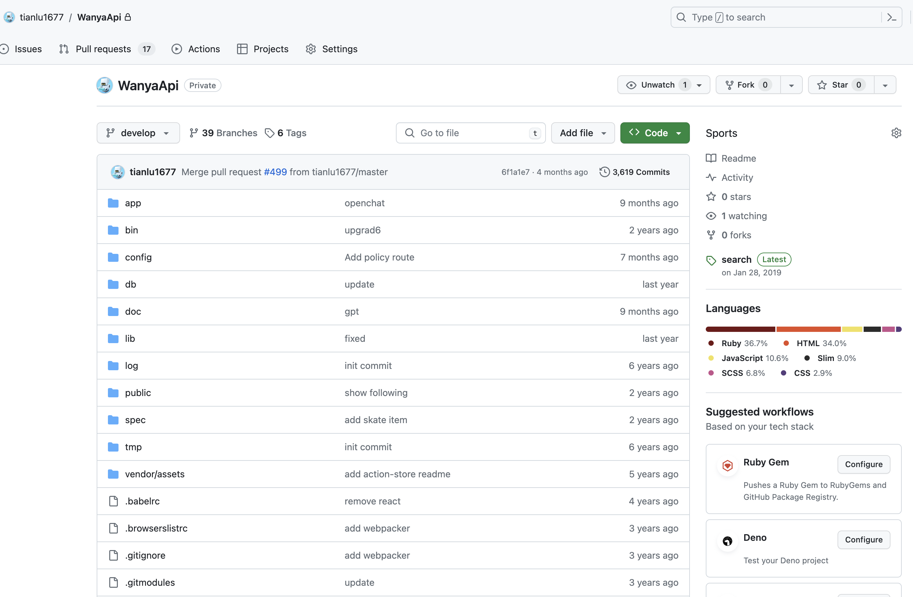
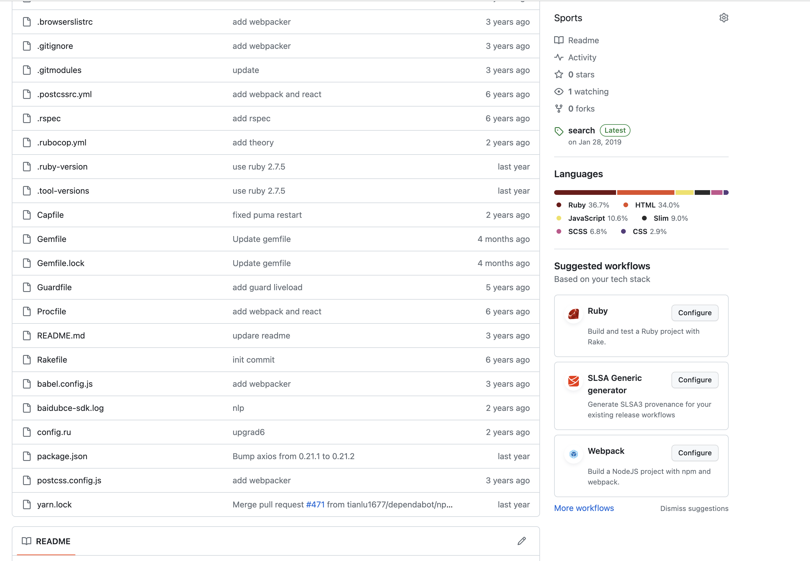

# Wanya App Server

New Youth Trend Culture Sanctuary

# This is open source software

MIT License

We attempted to operate an app to encourage more young people to explore new communities, including skateboarding, skiing, rap, and more. However, facing competition from platforms like Douyin and TikTok, we are unable to continue running the app, so we have decided to make it open source.

# App screens

I write the whole project by using the ruby on rails.

# This is Ruby on rails project.

The API and backend application were developed using Ruby on Rails and were entirely developed by me independently. However, some parts of the application involve sensitive information. If you are interested, please feel free to send me an email for further discussion.

Here include API and admin manage.

# APP 

https://github.com/tianlu1677/wanya_native